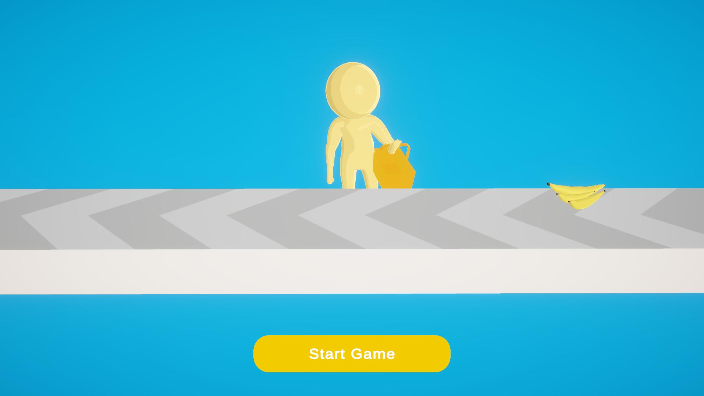

# Тестове завдання на Junior розробника
Цей проект - тестове завдання на Junior розробника. 
Хочу висловити подяку команді [K-Syndicate](https://www.youtube.com/@KSyndicate/streams), і беспосередньо Олексію Науменко за [ревью](https://www.youtube.com/watch?v=ZO2cvbNOw-4&lc=UgxNTq1Qx6tGjhg0UpJ4AaABAg) цього тестового.
Багато практик та підходів, які були використані у цьому тестовому я дізнався і начав застосовувати саме завдяки ним.
# Q&A
### Q: *На скільки днів розраховано тестове?*  
A: **7 днів**  
### Q: *За скільки днів було зроблене?*  
A: **4 дня**  
### Q: *Як робив анімації?*  
A: **Анімації були взяті з [Mixamo](https://www.mixamo.com/#/), ось гарне [відео](https://www.youtube.com/watch?v=-FhvQDqmgmU) на цю тему.**  
### Q: *Як робив інверсивну кінематику?*  
A: **Використовував [Animation Rigging](https://docs.unity3d.com/Packages/com.unity.animation.rigging@1.2/manual/index.html) пекедж від Unity, гарний [talk](https://www.youtube.com/watch?v=hs2goLjUz4U&t=982s) на цю тему.**
### Q: *Як робив шейдера?*  
A: **Шейдера робив сам, вже деякий час цікавлюся ними і тому в мене був вже готовий [Toon шейдер](https://github.com/quizandpuzzle/Unity-ToonURP), який ідеально підійшов для гри. Шейдер не досканалий та в ньому є баги, тому що я сам далеко не на тому рівні, щоб писати якісь складні, production-ready шейдера але я вирішив, що його буде достатньо для тестового.  
Є багато ресурсів, які я використовував вивчая шейдера, але найкрутіший старт, це серія відео ["Shaders for GameDevs"](https://www.youtube.com/watch?v=kfM-yu0iQBk&list=PLImQaTpSAdsCnJon-Eir92SZMl7tPBS4Z) від Freya Holmer**  

